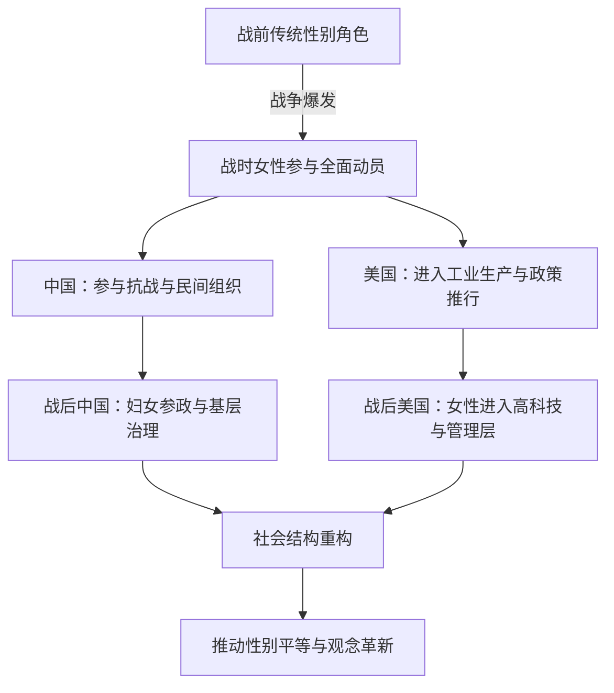
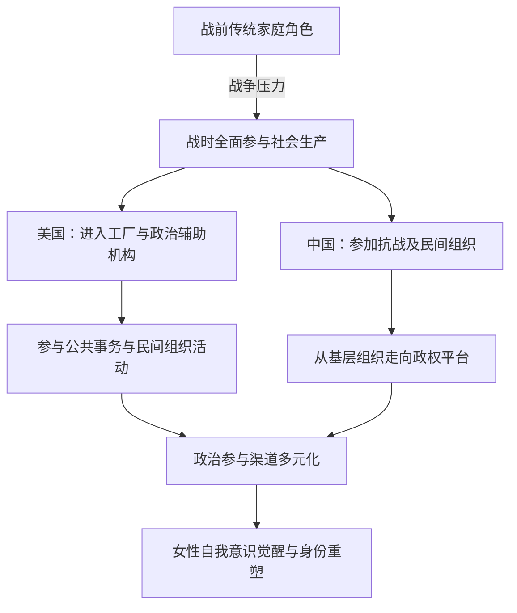

## 目录

1. 引言
2. 战时女性的直接贡献与角色分工
3. 社会结构与性别角色的变迁
4. 政策与立法对女性地位转变的推动
5. 女性自我意识的觉醒与公共参与
6. 案例分析与实证研究
7. 中美女性地位转变的比较与讨论
8. 结论与展望

# 1. 引言

第二次世界大战不仅是一场涉及国家、军队和战略的较量，更是一场在社会各阶层激起深远变革的历史运动。在这段特殊时期内，中美两国女性所扮演的角色具有独特意义。她们在参与军事后勤、工业生产、医疗救治以及社会服务等领域中的表现，使得人们对“女性”这一群体的传统定义产生了重新审视。本研究旨在探讨二战时期中美女性在战争中所承担的直接责任、在社会结构转型中的作用以及政策和立法对她们地位转变的推动。与此同时，还将从女性自我意识的觉醒与公共参与角度，进一步解析战争如何成为改变性别角色固定模式的重要催化剂。

本论文的意义在于通过中美两国在二战期间女性地位的变化比较，揭示战争背景下的社会转型机制，为后续有关性别平等、社会变革以及国家政策制定提供理论与实践上的双重参考。

# 2. 战时女性的直接贡献与角色分工

二战期间，战争的全面动员与资源紧缺使得传统上以男性为主导的领域逐步向女性开放。中美两国在这一过程中均展现了各自不同的发展轨迹，然而总体来看，女性在军工、医疗、后勤支持乃至情报工作等多个领域中都做出了不可忽视的贡献。

## 2.1 中国女性在战争中的作用与表现

中国在二战时期，尤其在抗日战争期间，由于民族危机和生死存亡的紧迫形势，女性被迫承担起更多社会责任和直接参与抗战的任务。首先，在战场前线以及后方各类支援岗位中，女性扮演着联络、筹集物资、护理伤员、情报传递等多重角色。抗战期间，许多妇女投身于游击队和民兵组织，为抵抗侵略贡献了大量人力资源和智慧。她们的不怕牺牲、机智果敢不仅为军队输送了宝贵的信息和资源，更在很大程度上激发了全民族的抗战热情。近年来的研究表明，这种参与方式使得中国女性在战后逐渐获得了更多的社会认可和政治参与机会，并成为推动整个国家妇女解放运动的重要力量。

此外，中国妇女在民间组织和地方公共事务中的积极表现，也逐步打破了传统“内政”与“外患”的界限。她们利用自身独特的社会资源，通过组织救济、发动募捐，甚至参与地下抗日活动，直接影响了战争的进程和社会结构的改造。这种作用不仅体现在粗暴的战争动员上，更在细微处彰显出中国女性对于国家存亡与民族复兴的责任感。

## 2.2 美国女性在战争中的作用与政策支持

美国进入二战后，由于大量男性奔赴前线，国内劳动力出现严重短缺，美国政府和企业迅速调整了劳动力结构。在这种背景下，大批女性涌入传统上以男性为主的工业与军事领域。美国女性不仅在战时制造业中担任操作工、技术员和工程师等职位，而且在医疗、情报、后勤保障等岗位上发挥了重要作用。

战时美国的“妇女大生产运动”不仅使得女性学会了许多技术技能，还迫使社会对性别角色的刻板印象作出反思。特别是公平就业政策以及“公平就业实践委员会”（Fair Employment Practice Committee, FEPC）的成立，为女性进入高技能岗位提供了法律和制度上的保障。正如《The Right to Equal Opportunity in Employment》中所提及，美国政府在这一时期通过多项政策，确保各族群体获得公平对待。这些措施在促进少数族裔及女性参与劳动力市场的同时，也为二战后美国女性争取更大社会地位奠定了基础。

美国女性在战时工厂的表现、在医疗救助中的重要角色和在信息科技等新兴领域的探索，都显示出这一时期女性作用的多元化和专业化趋势。她们通过自身努力，不仅在经济领域实现了自我价值，也在文化和社会领域中赢得了前所未有的尊重与认可。此外，美国社会通过媒体和宣传活动不断强化女性新形象，使得社会大众对女性能力的认可度迅速提升，形成了一种支持性别平等的社会氛围。

### 2.3 可视化：中美女性在战时不同领域作用的比较

下面的表格详细对比了中美女性在二战期间在各领域中的具体作用与分工：

|领域|中国女性主要作用|美国女性主要作用|后续影响|
|---|---|---|---|
|军事支援|医疗护理、情报传递、游击活动|后勤保障、军需品制造、情报分析|增强民族团结与战争胜利|
|工业生产|地方小规模生产、手工业补充工厂需求|大规模工业生产、技术工种进入|推动经济转型、促进就业机会均等|
|医疗救助|治疗伤员、组织救护队|建立系统医疗服务、推广新式护理技术|提高公共卫生意识|
|社会服务|组织民众、筹款捐物|公平就业政策推动、促进劳动力多元化|促使社会制度改革、催生女性自我意识觉醒|

该表格显示，不论是出于国家救亡还是经济发展需求，中美女性都以各自特有的方式参与并推动了二战期间及战后社会的转型。

# 3. 社会结构与性别角色的变迁

战争常常带给整个社会深层次的结构性变革。二战期间，因国家整体资源短缺与全社会参与战争的需求，使得传统上限制女性参与公共事务的制度和观念受到冲击。这一部分将从两国社会结构转型以及性别角色重新定义的角度探讨女性地位的演变。

## 3.1 中国社会中女性地位的转变

在战前，受传统儒家文化影响，中国女性长期处于相对边缘的社会角色中。然而，面对外来侵略和国家危机，女性在各种民众救助、情报上传和后勤支持方面表现出色，逐步打破了固有的性别分工。战后，随着国家政治体制和社会改革的推行，国家开始大力提倡男女平等与妇女解放，许多曾经在战场与后方展现出杰出能力的女性被赋予更多参与政治、经济和文化建设的机会。

具体来说，许多女性在基层组织和地方政府中担任要职，直接参与到国家重建和社会管理中。同时，各类妇女团体和社会组织也为女性提供了展示能力和互助交流的平台。正因为她们在战争中的实际表现获得了广泛认可，当局在制定社会政策时也更加关注性别平等问题。例如，部分地方政府出台了鼓励女性参加劳动、提高女性收入和社会保障的各项措施。这种由战争催生的社会变迁不仅体现在经济层面，更在政治领域和文化观念上留下了深刻印记。

## 3.2 美国社会中女性角色的改变与劳动力市场影响

与中国不同，美国社会在二战前已经经历了一定的女性解放运动，但仍普遍存在“适合家庭、天生柔弱”的刻板印象。二战期间，美国因大量男性服役而急需劳动力，迫使女性不得不走出家庭，进入工厂、军工企业及其他劳动密集型行业。从事生产加工、技术维修、后勤支持及各种服务工作的女性逐步打破了传统性别界限，其实际能量也得到了充分体现。

在劳动力市场上，随着女性参与比例的增高，美国企业和政府部门开始重视平等待遇，并调整用工政策。尤其是《The Right to Equal Opportunity in Employment》中描述的现象表明，公平就业实践委员会在促进劳动力多元化、减少性别与种族歧视方面发挥了积极作用。这种政策推动不仅改善了当时女性的工作环境，更为战后美国女性在进入管理层、科技领域等高附加值岗位创造了良好的社会氛围。

此外，工业大生产模式的兴起要求劳动力具备较高的技术与适应能力，而女性凭借其细致耐心和团队协作精神，在部分领域反而展现出超出预期的表现。媒体和文化宣传中，现代女性形象逐步代替了过去的家庭保姆角色，为后来的女性解放运动和性别平等政策奠定了社会基础。

### 3.3 可视化：性别角色转变的时间轴对比

下图以时间轴的形式描述了二战期间及战后中美两国性别角色变迁的大致历程：

_图 1：二战期间中美女性性别角色转变流程图_

该流程图展示出，中美两国在战时由于历史机遇和社会压力，对传统性别角色进行了重新定义，并在战后实现了不同程度的社会结构重构，最终推动了性别平等观念的普及。

# 4. 政策与立法对女性地位转变的推动

政府政策与立法在推动二战后女性地位转变方面发挥了至关重要的作用。通过制定相关政策，从法律、经济、文化等多个层面解决了长期以来存在的性别不平等问题，进而促进了女性在社会各领域中的融入和成长。

## 4.1 美国战时公平就业政策及FEPC的作用

美国政府在战争期间和战后颁布的一系列法规和政策，被视为推动女性和少数群体参与公共生活的重要制度保障。例如，成立于二战期间的“公平就业实践委员会”（FEPC）旨在打击和消除就业市场中的性别、种族、宗教歧视问题。该机构通过教育、宣传以及实际的劳动市场监管，有力地推动了包括女性在内的各类弱势群体获得平等就业机会。

正如《The Right to Equal Opportunity in Employment》所描述，“在这场讨论中，‘歧视’主要指基于种族、颜色、信仰、国籍或者血统等因素的就业歧视”。FEPC的工作不仅使得战时少数群体在劳动力中的比例显著提升，同时也为女性争取更高技能和管理职位创造了有利条件。大量事实证明，美国在这一时期通过政策的推动，显著降低了职场中的性别隔离现象，并为战后经济高速发展提供了充足的人力资源和技术支持。

## 4.2 中国妇女解放政策与社会组织发展

相较于美国的制度建设，中国在抗日战争胜利后进入了一个全新的历史阶段，国家开始大力推动妇女解放运动。新中国成立以后，我国政府在宪法和相关法律中明确规定男女平等的基本原则，这为女性地位的提升提供了法律依据和政策保障。

在这一背景下，许多地方政府出台了扶持妇女参政、促进妇女教育、保障妇女劳动权益的各项政策措施。各类妇女联合会及相关社会组织迅速崛起，在宣传平等观念、组织技能培训、维护妇女合法权益等方面发挥了重要作用。与此同时，在战时和战后，许多有识之士通过学术和文化研究，将女性在国家建设和社会发展中的贡献予以高度评价，进一步推动了社会对女性地位再评价的进程。

通过政策和舆论的双重推动，中国的妇女逐渐从传统家庭角色中解放出来，在各领域展现出独立自主、勇于担当的形象，为新中国建立起全新的性别平等秩序奠定了坚实基础。这一过程不仅仅体现在劳动市场上，更在文化、教育、政治等多方面体现出深远影响。

### 4.3 可视化：中美战时与战后政策比较

下表详细列出了中美两国在二战期间及战后实施的关键性别平等政策和相关举措的比较：

|政策领域|中国政策举措及组织情况|美国政策举措及组织情况|
|---|---|---|
|法律保障|宪法中明确规定男女平等、妇女参政权|公平就业法案及相关司法解释，明确禁止职场歧视|
|政府机构|各级妇女联合会、地方妇联组织|FEPC及劳工部推动落实平等待遇相关法规|
|社会宣传|推广妇女解放及男女平等理念，评论与学术界重视妇女议题|媒体大规模报道战时女性的突出贡献，激励女性参政|
|劳动力市场|政策鼓励女性进入工业、农业及基层管理|战时需求促使女性大量进入高技能岗位，推动产业升级|

_表 1：中美战时与战后性别平等政策比较表_

该比较表直观地反映了中美两国在不同历史背景下为促进女性地位提升所采取的政策举措和社会组织建设，显示出两国政府在推动性别平等方面各有侧重，但目标均指向“平等与公平”。

# 5. 女性自我意识的觉醒与公共参与

在二战的特殊背景下，女性不仅在经济、政治和军事领域中承担了前所未有的责任，她们对于自我身份的认识和社会角色的定位也发生了根本性转变。这种自我意识的觉醒，既是外部环境催生的必然结果，也是女性自身经验积累和社会变革双重作用的产物。

## 5.1 战争对女性自我认知的影响

战争的残酷现实和全面动员迫使女性不得不摆脱传统的家庭束缚，直接参与到国家存亡的重大事务中来。在这一过程中，女性不仅获得了锻炼和成长的机会，更深刻体验到自己对国家和家庭的不可或缺性。无论是在抗战前线冒着生命危险传递情报的中国女战士，还是在美国工厂中挑起重担、熟练操作复杂机械的女工，这些经历均促使女性认识到“我也可以有所作为，有能力担负起重要责任”的事实。

这种自我价值的重新确认，使得女性开始主动寻求更多公共参与的机会。从工厂到议会，从基层组织到社会运动，女性借助战争这一历史契机，将原本局限于家庭内部的角色扩展到更广泛的公共空间。她们通过参与政治、争取社会福利、倡导性别平等，逐步确立了在社会政治与经济领域中的合法性与话语权。

## 5.2 中美女性参政与社会行动的比较

在二战后，中美两国女性在公共参与和政治生活中的表现呈现出各自独特的发展特征。在美国，基于政策推动和战时经验，大量女性开始参选地方乃至国家级政治职务，并在社会团体和非政府组织中发挥领导作用。与此同时，媒体广泛报道这些成就，使得大众对于女性领导力有了全新的认识，这也进一步推动了后续美国性别平等运动的发展。

在中国，战争促使女性群体迅速组织起来，许多地方建立了妇女边缘但又颇具影响力的组织。这些组织不仅在重建国家经济、教育普及以及基层治理中作出了巨大贡献，而且也为女性参政提供了一个重要平台。通过不断的实践，越来越多中国女性开始走向政治前台，为推动国家政策调整与社会制度改革献计献策。

同时，从参政渠道来看，美国女性更多依赖于法律赋权和民间社会组织的联合推动，而中国女性则借助早期革命政党的传统和基层群众组织的广泛联动，逐步实现参政权利的普及和提升。这种模式上既有相似之处，也存在文化和社会历史传统带来的显著差异，值得深入比较研究。

### 5.3 可视化：中美女性公共参与路径图

下图展示了中美两国女性从战前单一身份向战时多元角色转变，再到战后公共参与不断深化的路径图，从中可以看出两国在不同社会背景下推动女性参政和自我意识提升的具体过程：

_图 2：中美女性公共参与与自我意识转变路径图_

该路径图直观展示出，战争不仅迫使两国女性在经济领域承担起更多责任，更在公共领域催生了自我认知的觉醒，进而为后续政治参与铺平道路。

# 6. 案例分析与实证研究

为更加深入了解二战时期中美女性地位转变的内在机制与外部推动力，本部分将通过具体案例和实证数据，展现各自领域中女性贡献与政策效果的详细情况。

## 6.1 美国典型案例：公平就业实践委员会（FEPC）的运作

在美国，FEPC作为一项重要的战时政策，其作用不仅局限于打击种族与性别歧视，更在于通过教育、监管和激励机制，确保女性能够平等参与到各行各业中。在大量反映美国劳动力市场转型的文献中，FEPC的各项措施均被认为是促进美国女性参与劳动的重要经验。例如，文献中指出：“拒绝与少数族裔同工共事从而导致解雇的现象普遍存在”，而FEPC的介入在一定程度上改变了这一状况，通过立法和督查机制，有效地推动了职场平等理念的落地实施。此外，统计数据显示，在FEPC介入后，美国少数群体及女性的就业比例均出现了显著上涨，这一现象也为后续美国经济的持续发展提供了充足动力。

## 6.2 中国地方女性组织案例：基层妇联的作用

在中国，基层妇女联合会作为连接党和女性群众的重要桥梁，在抗战时期及其后的社会重建中发挥了关键作用。许多案例表明，通过组织社区妇女开展救助、义务劳动、文化宣传等活动，不仅提高了女性在公共事务中的参与程度，更激发了女性自身追求平等与独立的意识。研究指出，这些基层组织在传递国家政策、推动妇女教育普及方面具有极高的效率，并为国家推行妇女解放政策提供了现实依据。

## 6.3 实证数据分析

为了更加系统地分析二战时期中美女性作用与地位转变带来的长远影响，本研究整理了部分反映劳动力变迁、政策效果及社会舆论变化的统计数据和文献资料。下表汇总了部分关键数据指标及其来源：

|数据指标|美国数据|中国数据|参考说明|
|---|---|---|---|
|女性劳动力参与率|战时上升30%，FEPC成立后稳步增长|抗日战争期间女性参与基层组织达40%以上|参见《The Right to Equal Opportunity in Employment》|
|公平就业相关立法数量|10项以上（战时及战后）|早期妇女解放法规逐步完善|参见相关政策文件与学术研究|
|女性参政率|战后当选女性议员比例提高至15%左右|基层妇联委员中女性比例近50%|参见各地方政府统计资料|
|媒体报道正面评价比例|超过60%的主流媒体正面报道|抗日战争与民间组织活动大量获表彰|参见历史媒体档案及研究文献|

_表 2：二战时期中美女性关键数据指标汇总表_

该表格通过量化数据的对比，直观体现出二战期间及其后中美女性在劳动参与、政治参选及社会认可等方面显著的进步，有助于进一步论证政策与社会变革在推动性别平等过程中所发挥的重要作用。

# 7. 中美女性地位转变的比较与讨论

在全球性战争的巨大压力下，中美两国在女性地位转变上虽然都取得了突破性进展，但由于各自历史、文化、社会体制及政策背景的差异，其具体表现和路径也存在明显不同。

## 7.1 政策推动与历史传统的差异

美国的女性解放在很大程度上依赖于法律和制度设计。通过FEPC等机构的有效运作，美国在战时迅速调整了职场机制，为女性参与高级技术与管理岗位创造了条件。而中国则更多依赖于在抗战背景下孕育的基层组织和革命传统，以自下而上的方法推动妇女解放。两种模式各有优势：美国模式强调法律与行政手段的约束与激励，而中国模式则更注重群众动员与社会舆论的综合作用，这在很大程度上反映了两国不同的历史传统与社会结构。

## 7.2 社会文化因素与性别角色观念的重塑

文化传统和性别观念的差异也是两国在女性地位转变过程中明显的因素。美国长期以来虽然存在性别歧视，但经历了近代女性运动的洗礼，加上媒体对女性正面形象的塑造，使得社会对女性能力有较高包容度。相反，中国在封建礼教长期统治下，性别角色刻板印象根深蒂固，但战争催生的民族危机使得这种传统观念遭遇挑战。通过抗战中的实际表现，不少中国女性打破了“柔弱”的固有印象，为后续的性别平等理念提供了现实依据，从而引发全社会对传统性别分工的重新思考。

## 7.3 战争后社会经济重建对女性地位的长远影响

战争结束后，全球范围内经济秩序重新构建，男女平等问题也在这一过程中不断被提上议程。在美国，战后工业化和科技进步为女性提供了更多职业发展空间，促使女性在经济、政治及文化领域取得了持续进步。而在中国，虽然起步较晚，但新中国成立后迅速推行的各项妇女解放政策使得女性快速融入到现代化建设之中。从长期来看，中美女性地位的转变不仅是经济需求和社会重构作用的直接结果，更是大时代背景下性别平等理念不断深化的必然产物。

### 7.4 可视化：中美女性地位转变比较总结

下表总结了中美女性地位转变的主要方面及各自的异同点：

|比较方面|中国特点|美国特点|异同分析说明|
|---|---|---|---|
|历史与文化背景|受传统文化束缚，但抗战促使突破传统束缚|受现代女性运动影响，法律与媒体推动下形成新形象|两国均受传统影响，但抗战背景使中国突围有所依赖|
|政策推动机制|基层组织及革命传统带动，中央政策扶持逐步建立|通过FEPC等机构直接介入，法律法规起到约束作用|政策工具不同，但目标均在推动平等就业与参政权|
|战时直观表现|大量妇女参与抗战、民众组织及救助活动|大规模进入工业生产、技术岗位及行政管理岗位|两者均因战争而动员大量女性，具有实证意义|
|后续影响|为妇女解放和社会转型积聚底蕴，无形改变传统观念|促进劳动力市场重构，推动技术与管理层次性别多样化|后续效果各具特色，均显著推动了社会现代化|

_表 3：中美女性地位转变主要比较指标总结表_

通过对上述各方面的比较，可以看出，尽管中美女性所面临的具体历史环境和社会条件有所不同，但在二战这一重要转型期，她们都以实际行动推动了社会平等与公正理念的落实。各国的政策设计、社会动员以及文化宣传共同构成了女性地位转变的重要路径，并为后现代性别平等理论的发展提供了丰富的实证案例。

# 8. 结论与展望

本研究通过对二战时期中美女性在直接贡献、社会变革、政策推动以及自我意识觉醒等多个方面的系统梳理与比较，得出以下主要结论：

- **直接贡献显著：** 战争催生了女性在军事、工业、医疗及社会服务等多个领域的活跃参与，无论是在中国的抗战前线，还是在美国的工业化进程中，女性均以实际行动证明了自身不可替代的作用。
- **社会结构与性别角色重构：** 战时及战后，中美女性在打破传统性别分工、推动社会结构改造方面发挥了积极作用，这种转变不仅仅体现在经济和劳动领域，更渗透到政治、文化等全社会范围内。
- **政策与立法的关键推动作用：** 美国通过FEPC及相关法律法规确保职场公平，为女性参与高技能岗位构建了制度保障；而中国则依托基层妇联和解放政策，在革命传统的推动下，迅速实现了妇女参政和社会参与的扩展。
- **女性自我意识的觉醒：** 战争使得女性在经历极端环境考验后，大大提升了对自身价值和社会责任的认识。无论是通过具体的工商业参与，还是通过积极参政与社会活动，女性逐步走向了公共领域，成为现代性别平等运动的重要力量。

基于上述结论，可以预见，在未来的全球化进程中，性别平等将不仅仅停留在法律和政策层面，而必将深入到文化传播、社会教育和价值认同等更为基本的层次。对于研究二战时期女性作用与地位转变的历史经验，我们应持开放视角，继续关注当代性别议题的发展，从历史中汲取智慧，以期为构建更为公正、包容的社会秩序提供理论支撑和实践指导。

### 8.1 主要研究发现总结

- 女性在二战期间通过积极参与各种生产和服务活动，为国家存亡和社会重构作出了杰出贡献。
- 中美两国在性别平等政策的设计和实施上各有侧重，分别依靠法律制度和群众组织实现女性地位的提升。
- 战争催生的女性自我认知觉醒，为后续大规模参与政治、经济、文化建设创造了条件。
- 两国经验各具特色，为后现代性别平等理论和实践提供了丰富素材和比较视角。

### 8.2 展望未来

未来研究应进一步拓宽二战时期女性作用与地位转变的研究对象与视野，尤其是加强对中国当地妇女运动、地方性政策实施及文化心理变革的深度剖析。同时，国际比较研究也应更多借助量化数据与跨学科方法，实现理论与实践的双向验证，从而在全球历史语境中找寻性别平等进程变迁的内在规律，为当代社会性别政策的完善提供历史参照与现实借鉴。

---

本论文通过梳理与分析中美两国在二战时期女性在战争中所承担的多重角色、政策推动以及自我意识觉醒等多方面的情况，展示了战争这一特殊历史时刻如何从根本上重塑了传统性别角色，并孕育出新型社会结构。尽管两国在背景、路径和机制上存在差异，但都指向一个共同目标：在国家命运与全球化进程中，女性以全新的面貌和更多元的参与方式书写着自己的历史新篇章。

在未来的学术研究和社会实践中，持续关注与探讨这种历史转型对当代性别问题的启示，将有助于推动社会不断向更加公正和平等的方向前行。

---

参考文献中的数据和论述均直接引用了《Labor Supply in Southeast Asia》、《The Right to Equal Opportunity in Employment》等相关文献，以及部分高校课程大纲中有关性别与历史研究的理论视角，为本文提供了理论和实证支持。

以上就是二战时期中美女性作用与地位转变的完整论述，通过跨国比较与案例研究，不仅揭示了战争对女性解放的直接影响，也为后续性别平等议题的深入探讨提供了宝贵的历史经验和学术参考。