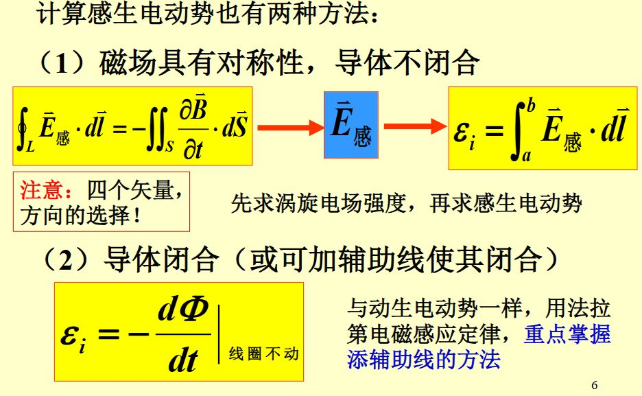

!!! abstract

方向，先设正方向（线圈右手螺旋与磁场一致）

[考核标准](考核标准)

## 笔记

1.1

[静电场](静电场)

([大物作业一.pdf](大物作业一.pdf))

2.1

[静电场中导体](静电场中导体)

2.2

[电容](电容)

[电介质](电介质)

([大物作业2.pdf](大物作业2.pdf))

3.1

[静电场中能量](静电场中能量)

3.2

[稳恒电流](稳恒电流)

考试

4.1

[真空中稳恒磁场](真空中稳恒磁场)

（[大物作业3.pdf](大物作业3.pdf)）

[安培环路定理](安培环路定理)

4.2

[磁力](磁力)

（[大物作业4.pdf](大物作业4.pdf)）

5.1

[磁介质机理](磁介质机理)

[磁介质时磁场规律](磁介质时磁场规律)

（[大物作业5.pdf](大物作业5.pdf)）

考试

6.1

[电磁感应](电磁感应)

[动生电动势](动生电动势)

6.2

[感生电动势](感生电动势)

注意负号 $\epsilon=-\frac{d\phi}{dt}$

[自感](自感)

（[大物作业6.pdf](大物作业6.pdf)）

7.1

[互感（物理）](互感（物理）)

交换性、注意匝数 N

[磁场能量密度](磁场能量密度)

7.2

[位移电流，全电流安培环路定理](位移电流，全电流安培环路定理)

[电磁波](电磁波)

（[大物作业7.pdf](大物作业7.pdf)）

各个定理计算中 $\mu_{0},\epsilon_{0}$ 不要忘记

注意区分磁场强度 H，磁感应强度 B，磁化强度 M

电场强度 E，电位移矢量 D，极化强度 P

$\vec{S}=\vec{E}\times\vec{H}$

对于矢量，写明大小方向
