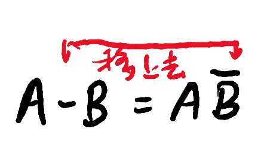
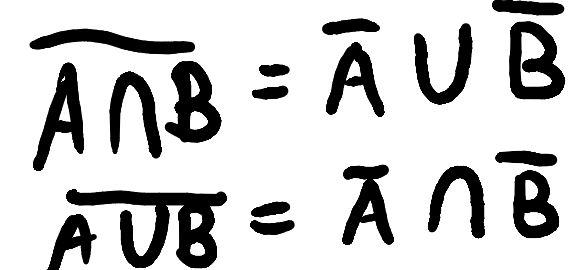
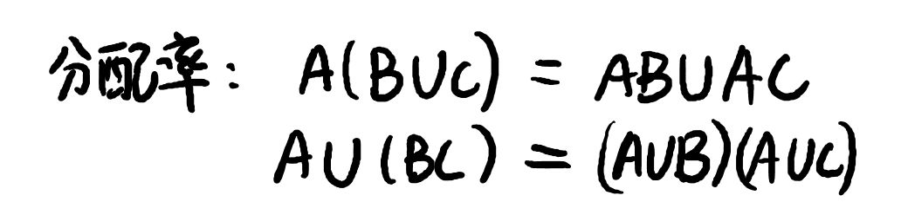
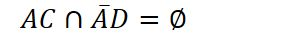
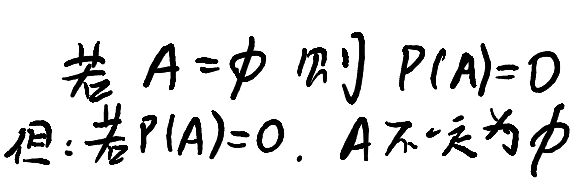
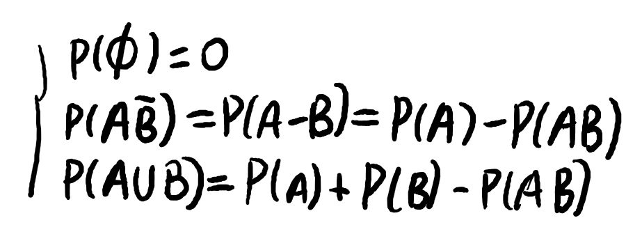
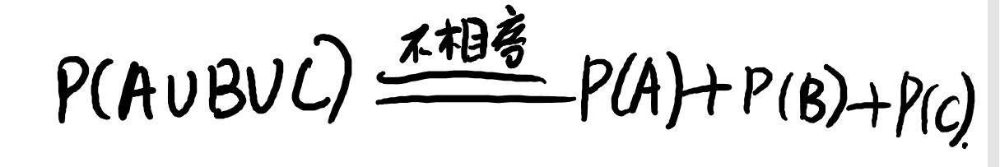

```dirtree
- 样本空间
  - 事件
    - 样本点（元素）
```

### 事件

#### 习惯写法

- 随机：A,B,C
- 必然：S
- 不可能事件：∅
- A-AB=A-(A∩B)

#### 事件关系

。。。

#### 事件关系的变换技巧

1. '-'的位置可以变
   
2. '对偶率'：打断换号
   
3. 分配率
   
4. 如果 A,B 不相容（A∩B=∅.则 AC∩BD 必为 ∅）特殊的：

### 概率

频率-稳定->概率

#### 几个理解

1. 

2. 概率可以对应到韦恩图中的面积

3. 概率的加法

4. 

5. 若事件之间不相容，