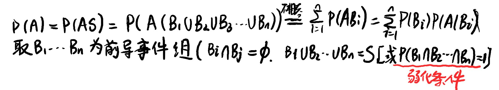

## 贝叶斯公式

$P(A|B) = \frac{P(B|A) \cdot P(A)}{P(B)}$

### 解题

定义问题为事件，进行划分（构造必然事件）明确事件发生的原因，先验、后验（贝叶斯）

特殊的，最短周期内利用全概率公式构造递归

#### 先验

全概率

#### 后验

贝叶斯

### 抽签原理

只要没有得到新的已知条件，概率不变

（溶液浓度问题）

## 独立

### 定量

事件 $A_1, A_2, \ldots, A_n$ 互相独立, 需对任意 $1 \le k \le n$、任取 $k$ 个不同的事件

$$P(A_{i_1} \cap A_{i_2} \cap \cdots \cap A_{i_k}) = P(A_{i_1}) \cdot P(A_{i_2}) \cdots P(A_{i_k})$$

即任意子集都满足乘法法则。

### 性质

传递性：逆事件依然独立

独立依据概率

不相容根据事件

"独立"与"不相容"不会同时成立