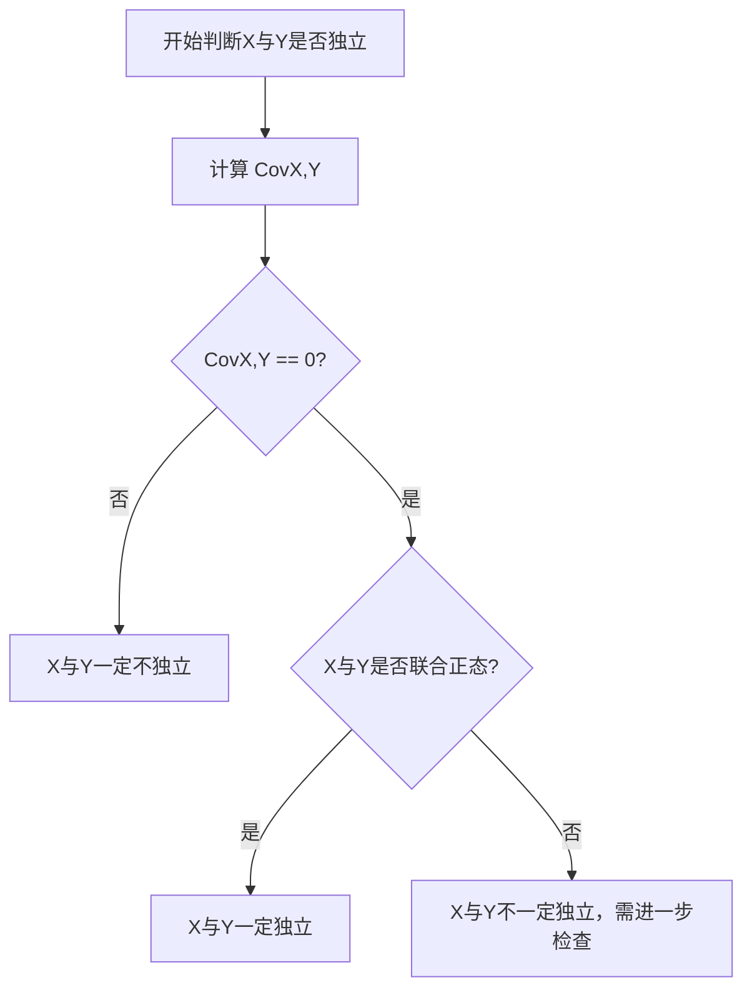

重点掌握

分析相关性：

[notebooklm：总结](notebooklm：总结)

## 方差定义

Var（X）或 D(X)
$D(x) = E[(X-E(X))^2] = E(X^2) - (E(X))^2$

## 方差性质

$D(aX+b) = a^2 D(X)$

$\text{Var}(X \pm Y) = \text{Var}(X) + \text{Var}(Y) \pm 2\text{Cov}(X, Y)$

## 协方差定义

$Cov(X,Y) = E[(X-E(X))(Y-E(Y))] = E(XY) - E(X)E(Y)$

## 协方差性质

$Cov(aX+b, cY+d) = ac Cov(X,Y)$

$Cov(X_1 + X_2, Y) = Cov(X_1, Y) + Cov(X_2, Y)$

X, Y 相互独立，则 $Cov(X,Y) = 0$

若协方差为负，则 X，Y 负相关

## 相关系数定义

$\rho_{XY} = \frac{Cov(X, Y)}{\sigma_X \sigma_Y}$

协方差的标准化形式，衡量 $X$ 和 $Y$ 之间**线性关系紧密程度**的无量纲量

## 相关系数性质

若 X 与 Y 相互独立，则 $\rho_{xy} = 0$, 反之不成立

当 X，Y 有严格线性关系时，$\rho_{xy} = 1$

## 六大分布

#review2

| 分布类型 (Distribution) | 概率密度 function $f(x)$ 或 分布律 $P\{X=k\}$ | 数学期望 $E[X]$ | 方差 $Var[X]$ | 随机变量 $X$ | 分布 function $F(x)$ (CDF) |
| --- | --- | --- | --- | --- | --- |
| **0-1 分布** (Bernoulli) | $(1-p)^{1-k}$ | $p$ | $p(1-p)$ | 离散型，$k \in \{0, 1\}$ | |
| **二项分布** $B(n, p)$ (Binomial) | $C_n^k p^k (1-p)^{n-k}$ | $np$ | $np(1-p)$ | 离散型，$k \in \{0, 1, \dots, n\}$ | |
| **泊松分布** $P(\lambda)$ (Poisson) | $\frac{\lambda^k}{k!} e^{-\lambda}$ | $\lambda$ | $\lambda$ | 离散型，$k \in \{0, 1, 2, \dots\}$（$\lambda > 0$） | |
| **均匀分布** $U(a, b)$ (Uniform) | $f(x) = \frac{1}{b-a}, a < x < b$ | $\frac{a+b}{2}$ | $\frac{(b-a)^2}{12}$ | 连续型，$a < x < b$ | |
| **指数分布** $E(\lambda)$ (Exponential) | $f(x) = \lambda e^{-\lambda x}, x > 0$ | $\frac{1}{\lambda}$ | $\frac{1}{\lambda^2}$ | 连续型，$x > 0$（$\lambda > 0$） | $F(x) = 1 - e^{-\lambda x}, x > 0$ |
| **正态分布** $N(\mu, \sigma^2)$ (Normal) | $f(x) = \frac{1}{\sqrt{2\pi}\sigma} e^{-\frac{(x-\mu)^2}{2\sigma^2}}$ | $\mu$ | $\sigma^2$ | 连续型，$x \in (-\infty, +\infty)$ | $F(x) = \Phi\left( \frac{x-\mu}{\sigma} \right)$ |