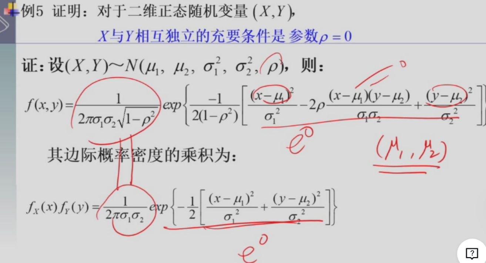
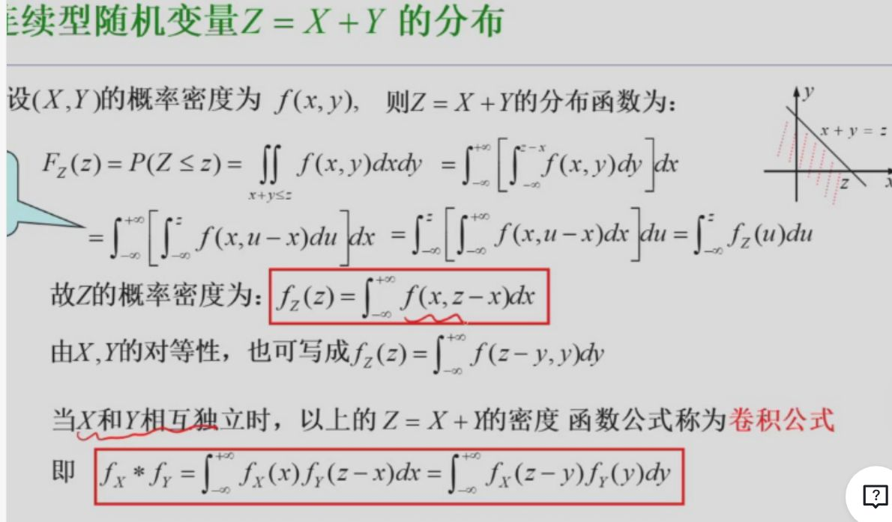
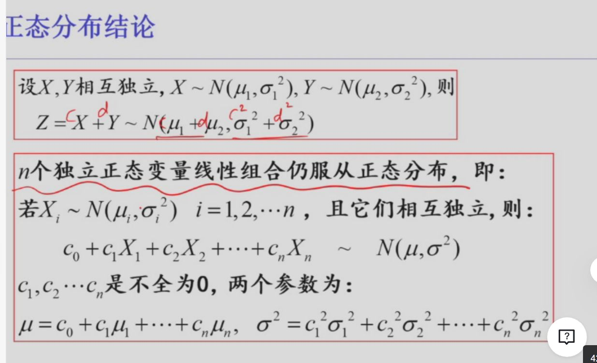

#review2

### 预备知识

==如果 X 与 Y 相互独立，那么 X 的任意 function g(X) 与 Y 的任意 function h(Y) 也相互独立==

## 定义

==$\begin{aligned} &P(X \leq x, Y \leq y) = P(X \leq x) P(Y \leq y) \quad \text{即} \\ &F(x,y) = F_X(x) F_Y(y) \end{aligned}$==

且 $f(x,y) = f_X(x) f_Y(y)$

> [!note]- 解释
> 这是一个非常核心的概率论问题。我们来从定义出发，严谨地解释：
> 为什么当连续型随机变量 \(X\) 和 \(Y\) 独立时，其联合概率密度 function 满足
> \[
> f_{X,Y}(x, y) = f_X(x) f_Y(y)
> \]
>
> 一、基本定义回顾
>
> 1. 独立性的定义（分布 function 层面）
> 随机变量 \(X\) 和 \(Y\) 独立，当且仅当对任意实数 \(x, y\)，有：
> \[
> F_{X,Y}(x, y) = P(X \le x, Y \le y) = P(X \le x) P(Y \le y) = F_X(x) F_Y(y)
> \]
> 这是独立性的根本定义，适用于所有类型的随机变量（离散、连续、混合）。
>
> 2. 连续型随机变量的密度 function
> 若 \((X, Y)\) 是连续型随机向量，则存在一个非负可积 function \(f_{X,Y}(x, y)\)，使得：
> \[
> F_{X,Y}(x, y) = \int_{-\infty}^x \int_{-\infty}^y f_{X,Y}(u, v) \, dv \, du
> \]
> 并且边缘密度为：
> \[
> f_X(x) = \int_{-\infty}^\infty f_{X,Y}(x, y) \, dy, \quad
> f_Y(y) = \int_{-\infty}^\infty f_{X,Y}(x, y) \, dx
> \]
>
> 二、从独立性推导出密度乘积形式
>
> 假设 \(X\) 和 \(Y\) 是连续型且独立的。
>
> 由独立性定义：
> \[
> F_{X,Y}(x, y) = F_X(x) F_Y(y)
> \]
>
> 由于 \(X\) 和 \(Y\) 是连续型，\(F_X\) 和 \(F_Y\) 几乎处处可导，其导数就是密度 function：
> \[
> f_X(x) = \frac{d}{dx} F_X(x), \quad f_Y(y) = \frac{d}{dy} F_Y(y)
> \]
>
> 现在对联合分布 function \(F_{X,Y}(x, y) = F_X(x) F_Y(y)\) 求混合偏导数：
>
> \[
> f_{X,Y}(x, y) = \frac{\partial^2}{\partial x \partial y} F_{X,Y}(x, y)
> = \frac{\partial^2}{\partial x \partial y} \big[ F_X(x) F_Y(y) \big]
> \]
>
> 因为 \(F_X(x)\) 与 \(y\) 无关，\(F_Y(y)\) 与 \(x\) 无关，所以可以分离求导：
>
> \[
> = \left( \frac{d}{dx} F_X(x) \right) \cdot \left( \frac{d}{dy} F_Y(y) \right)
> = f_X(x) f_Y(y)
> \]
>
> 因此，在几乎处处（即除了一个测度为零的集合外），有：
> \[
> f_{X,Y}(x, y) = f_X(x) f_Y(y)
> \]
>
> 这正是我们要证明的结论。
>
> 三、直观理解
> 联合密度 \(f_{X,Y}(x,y)\) 描述的是在点 \((x,y)\) 附近单位面积内 \((X,Y)\) 落入的概率"浓度"。
> 如果 \(X\) 和 \(Y\) 独立，那么知道 \(X\) 的取值完全不影响 \(Y\) 的分布，反之亦然。
> 因此，它们在 \((x,y)\) 处的"联合浓度"就应该是各自"浓度"的乘积 —— 就像两个独立事件同时发生的概率等于各自概率的乘积。
>
> 四、注意点
> 上述推导依赖于 \(X\) 和 \(Y\) 是连续型，这样才有密度 function，并且联合分布 function 可微（几乎处处）。
> 对于离散型随机变量，对应结论是：
> \[
> P(X = x, Y = y) = P(X = x) P(Y = y)
> \]
> 反过来也成立：如果 \(f_{X,Y}(x,y) = f_X(x)f_Y(y)\) 几乎处处成立，则 \(X\) 和 \(Y\) 独立。
>
> 总结
> 因为独立性意味着联合分布 function 可分解为边缘分布 function 的乘积，而对连续型变量，密度 function 是分布 function 的二阶混合偏导，导数运算保持乘积结构，从而得到联合密度等于边缘密度的乘积。
>
> 这就是数学上严格且直观的解释。
>
## 判别

1. 离散型：
   $\begin{aligned} &\text{用分布律判断。对一切 } i,j \text{ 都成立 } p_{ij} = p_{i\bullet} p_{\bullet j} \\ &\text{即 } P(X=x_i, Y=y_j) = P(X=x_i) P(Y=y_j) \end{aligned}$
2. 连续型：
   用密度 function 判断。对在平面的点 (x,y) 几乎处处成立 $f(x,y) = f_x(x) f_y(y)$ 即在平面上除去"面积"为零的集合以外，上述等式处处成立。
   **经验上，几何图形一定是方方正正的**

### 正态分布

### 卷积公式/半成品公式

> [!note]
> 已知 $f(x,y), Z = X+Y$, 求 $f_Z(z)$ 步骤
>
> $f_Z(z) = \int_{-\infty}^{+\infty} f(x, z-x) dx \overset{XY 独立}{=} \int_{-\infty}^{+\infty} f_X(x) f_Y(z-x) dx$
>
> 1. 确定由 x 与 z 构成的被积 function 非零区域
>
> 2. 在 x 与 z 作为坐标系统上，画出非零区域图形
>
> 3. 根据 z 分段，在各段上对 x 求积分
>
> [!note]- 理解
> 要得到 $Z = X+Y$ 在值 $z$ 处的密度，需要把所有满足 $x+y=z$ 的联合密度 $f(x,y)$ 沿着这条直线
>
"加起来"。

$\boxed{f_Z(z) = \int_{-\infty}^{+\infty} f(x, z-x) dx}$

$f_X * f_Y = \int_{-\infty}^{+\infty} f_X(x) f_Y(z-x) dx = \int_{-\infty}^{+\infty} f_X(z-y) f_Y(y) dy$

特殊的：对正态分布：$\begin{aligned} &\text{设 } X,Y \text{ 相互独立}, X \sim N(\mu_1, \sigma_1^2), Y \sim N(\mu_2, \sigma_2^2), \text{则} \\ &Z = cX + dY \sim N(c\mu_1 + d\mu_2, c^2 \sigma_1^2 + d^2 \sigma_2^2) \end{aligned}$

> [!note]-

[最小最大分布](最小最大分布)