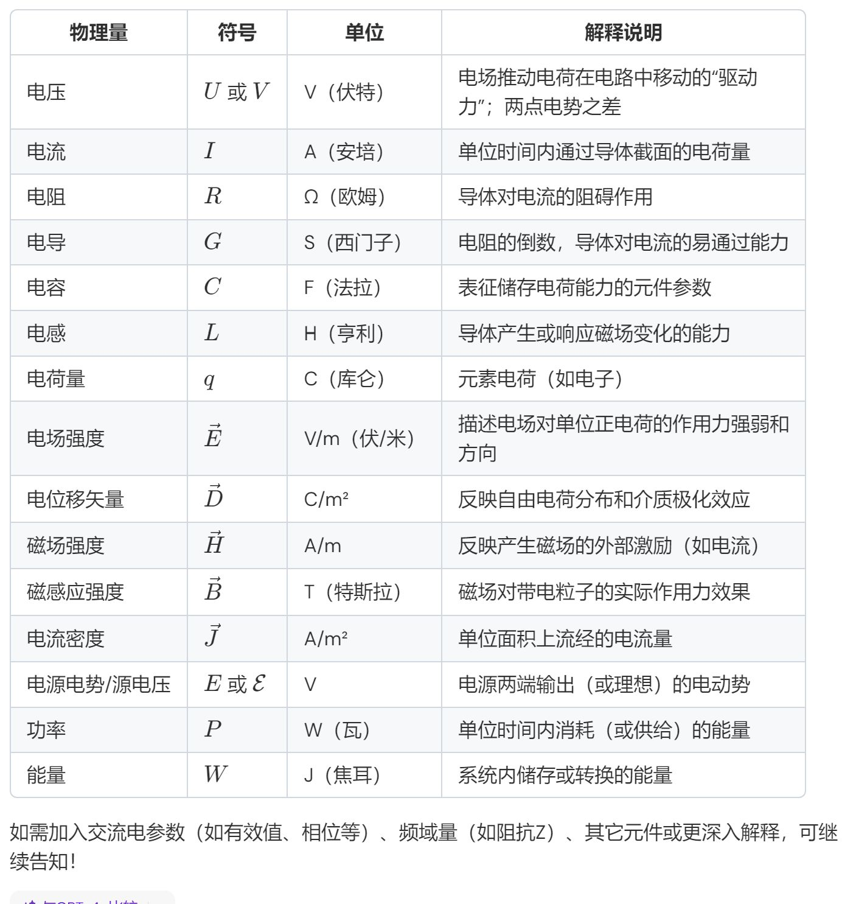

> [!note]- 麦克斯韦方程组
电荷是电场的源头/磁单极/电生磁/磁生电

| 微分形式方程 | 积分形式方程 | 物理含义 |
| --- | --- | --- |
| $\nabla \times \vec{E} = -\frac{\partial \vec{B}}{\partial t}$ | $\oint \vec{E} \cdot d\vec{l} = -\frac{\partial}{\partial t} \left( \int_s \vec{B} \cdot d\vec{s} \right)$ | 电磁感应定律 |
| $\nabla \times \vec{H} = \vec{J}_c + \frac{\partial \vec{D}}{\partial t}$ | $\oint \vec{H} \cdot d\vec{l} = \int_s \left( \vec{J}_c + \frac{\partial \vec{D}}{\partial t} \right) \cdot d\vec{s}$ | 全电流定律 |
| $\nabla \cdot \vec{D} = \rho$ | $\oint \vec{D} \cdot d\vec{s} = \int_V \rho dV$ | 高斯定理 |
| $\nabla \cdot \vec{B} = 0$ | $\oint \vec{B} \cdot d\vec{s} = 0$ | 磁通连续性原理 |
| $\nabla \cdot \vec{J}_c = -\frac{\partial \rho}{\partial t}$ | $\int_s \vec{J} \cdot d\vec{s} = -\frac{dq}{dt}$ | 电流连续性原理 |

> [!note]- 物理量及符号

[电路原理要求](电路原理要求)

1.1

[集总电路抽象](集总电路抽象)

[国际单位制](国际单位制)

[物理量](物理量)

[电路元件](电路元件)

[基尔霍夫定律](基尔霍夫定律)

1.2

预习了，没讲：[线性无关的KCL与KVL](线性无关的KCL与KVL)

第四章：[等效变换法](等效变换法)

1.3

[电路分析法](电路分析法)

[电路定理](电路定理)

3.

[二四章做题方法整理](二四章做题方法整理)

3.2

[正弦稳态分析](正弦稳态分析)

[功率](功率)

4.1

[谐振](谐振)

4.2

[互感](互感) 不大行

注意去耦的方向，同名端相连，公共支路取正号

[变压器](变压器) ok

5.1

[三相交流电路](三相交流电路)

[不对称三相电路](不对称三相电路)

[三相功率](三相功率)

5.2

[非正弦](非正弦)

[非正弦电路稳态分析](非正弦电路稳态分析)

!唯一考试注意：处理交流电流/电压转换成有效值

5.3

[动态电路暂态分析：初值](动态电路暂态分析：初值)

[动态电路暂态分析：直流一阶电路](动态电路暂态分析：直流一阶电路)

6.1

[阶跃响应](阶跃响应)

[冲激响应](冲激响应)

复习：

1. 三相中相位差是顺时针转的
2. 非正弦注意交流电流/电压转换成有效值
3. 算时间常数等效电阻注意保留受控源，用加压加流法做