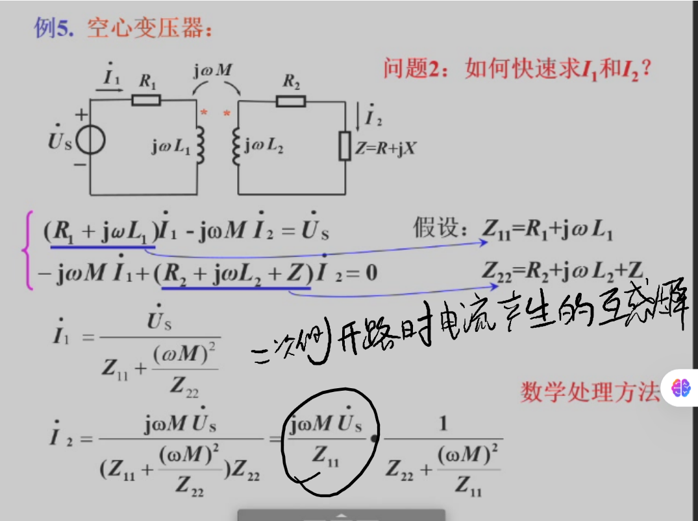
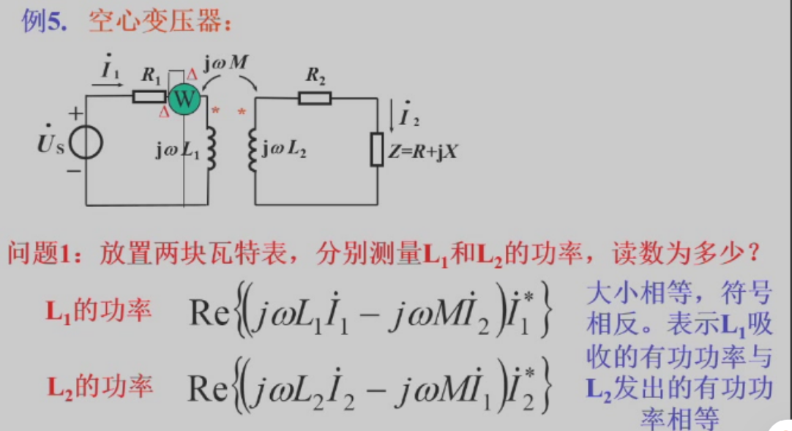
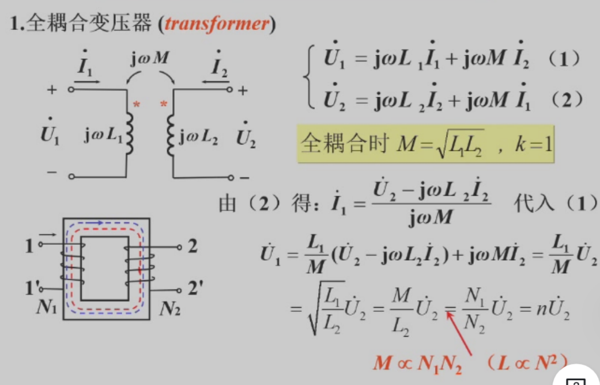
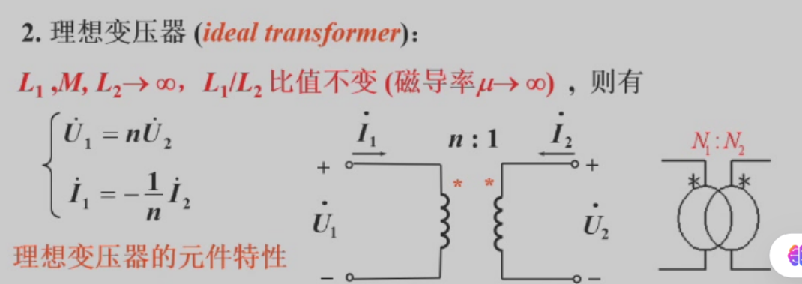
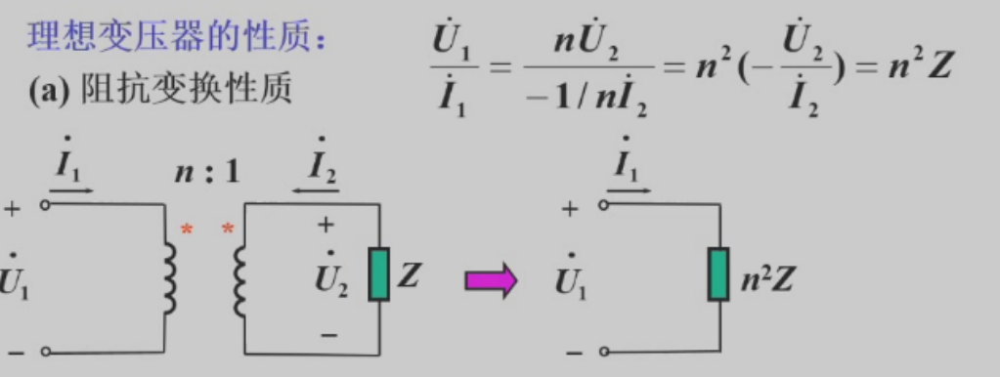

!!! abstract
$Z_{12} = \frac{(wM)^2}{Z_{22}}$
$Z_{21} = \frac{(wM)^2}{Z_{11}}$
$U_{21} = jwM \cdot \frac{\dot{U}_s}{Z_{11}}$
$\dot{U}_1 = n\dot{U}_2$
$\dot{I}_1 = -\frac{1}{n}\dot{I}_2$
$\dot{R}_1 = \frac{\dot{U}_1}{\dot{I}_1} = n^2 Z$

### 空心变压器（k < 1，存在漏磁通）

#### 一次侧二次侧关系

$Z_{12} = \frac{(wM)^2}{Z_{22}}$

$Z_{21} = \frac{(wM)^2}{Z_{11}}$

$U_{21} = jwM \cdot \frac{\dot{U}_s}{Z_{11}}$ 【理解：二次测断路，求一次侧电流，再互感到二次测成为电压】

#### 功率关系

### 全耦合变压器（k = 1，无漏磁通，通常需要一个理想铁芯（磁导率 μ 为有限值，但足够高））

$M = \sqrt{L_1 L_2}$

### 理想变压器（在"全耦合"的基础上，进一步假设磁芯的磁导率 μ → ∞）

仅由一个变比 n = N₁/N₂ 来定义。不再需要 L₁, L₂, M 等参数

#### 性质

$\dot{U}_1 = n\dot{U}_2$

$\dot{I}_1 = -\frac{1}{n}\dot{I}_2$ 如图

$\dot{R}_1 = \frac{\dot{U}_1}{\dot{I}_1} = n^2 Z$ 如图

