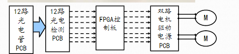
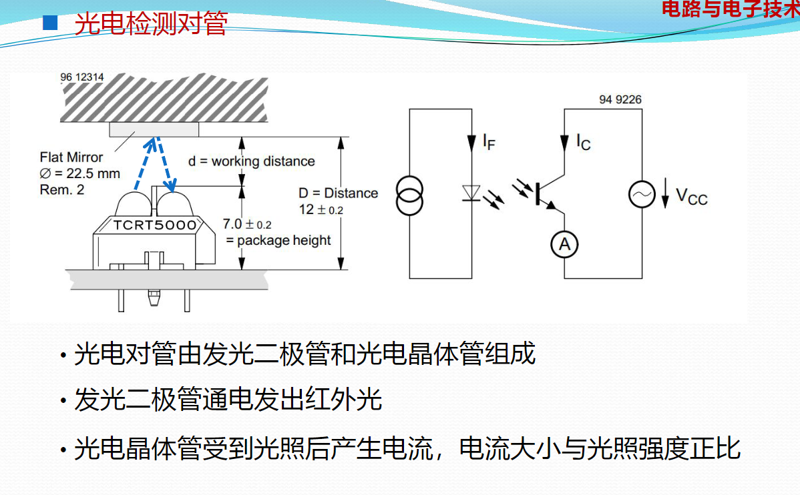

## 电动汽车

大三电：电池、电控、驱动电机

负反馈：矫正

正反馈：增强

## 实验 1

 电流源

截止饱和，产生不同电平

 光电对管

集成比较器：逻辑信号 -》数字信号。计较基础电压电平与上方电压。有圆圈：输入反向端

I_C 光生电流

 0-5 V 基础电压

### 参数

 输入输出回路参数

### 集成比较器

 正 5 V 仍可继续使用

需要有上拉电流才正常的逻辑信号!？[最全讲解上下拉电阻 - 知乎](https://zhuanlan.zhihu.com/p/429642282)

 上拉电阻

 用二极管显示小车轨迹位置

**就近找地，电路越小越好**

### 实验内容

 一个范围

电压 20 V，0.5 A

## 直流电机

 12 或 34 不能同状态，否则短路

加反向二极管，使电感电流先趋近于 0

 是能信号
